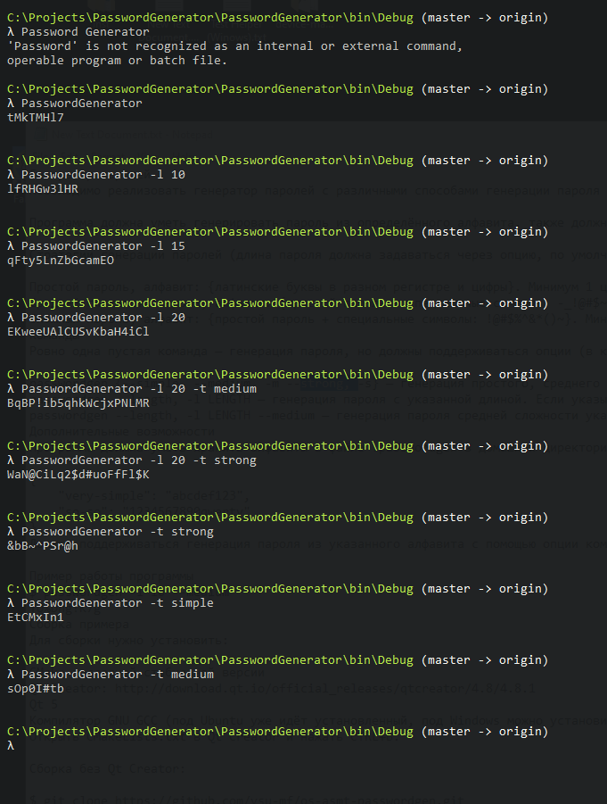

# passwordgenerator

Examples:
1. PasswordGenerator - creating simple pass;
2. PasswordGenerator -l <you_number> - creating simple pass of a given length
3. PasswordGenerator -t <you_types> - creating pass of a given type

Types of password:
-simple (default)
-medium
-strong
 
 Screenshot example:

